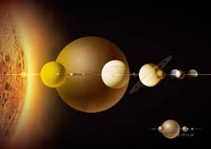
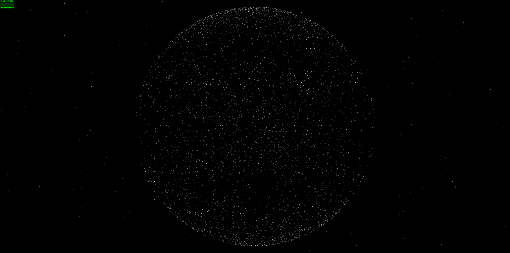
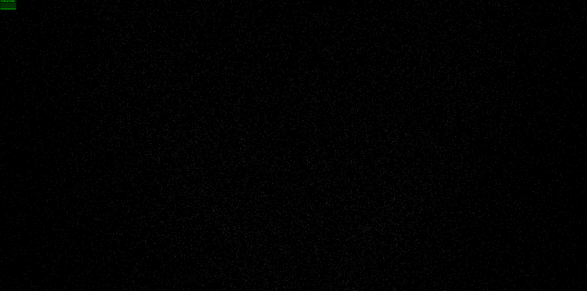

<div align="center">

[//]: # (  )
  <h1>Three.js太阳系与奥特云demo</h1>
</div>

## ⚡ 简介

- 采用vue3 + vite + Three.js实现太阳系八大行星与太阳和外层奥特云。


- 仓库地址：[Github](https://github.com/y467770447/solar-system)

## 📺 项目网址

- 暂未线上部署

```bash
# 配置
1. node 版本 18.17.0
2. npm 版本 8.x 以上

# 进入项目目录
cd solar-system

# 安装依赖
npm install

# 启动服务
npm run dev
```

## 🔧 代码检查

```bash
# 代码格式化
pnpm lint

# 单元测试
pnpm test
```

## Git 提交规范参考

- `feat` 增加新的业务功能
- `fix` 修复业务问题/BUG
- `perf` 优化性能
- `Optimization` 优化现有功能
- `style` 更改代码风格, 不影响运行结果
- `refactor` 重构代码
- `revert` 撤销更改
- `test` 测试相关, 不涉及业务代码的更改
- `docs` 文档和注释相关
- `chore` 更新依赖/修改脚手架配置等琐事
- `workflow` 工作流改进
- `ci` 持续集成相关
- `types` 类型定义文件更改
- `wip` 开发中

## 项目预览图





## 📄 License

[MIT](./LICENSE)

Copyright © 2024-present - wlw7890000@163.com
